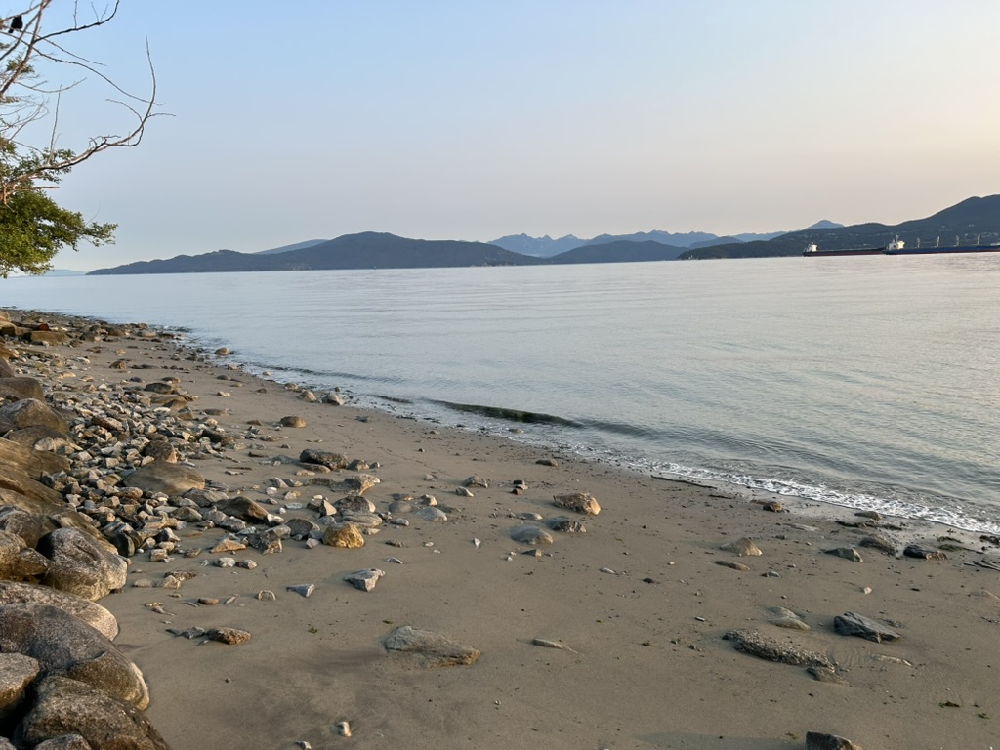

Graduate Student Yvette Gaytan presented her thesis preliminary results and plans moving forward. Great work Yvette! 
It was such a inspirational meeting, great science, community, and conference venue (picture from a morning walk). 
Can't wait to for next ICBF in Manaus, Brazil in 2028!

